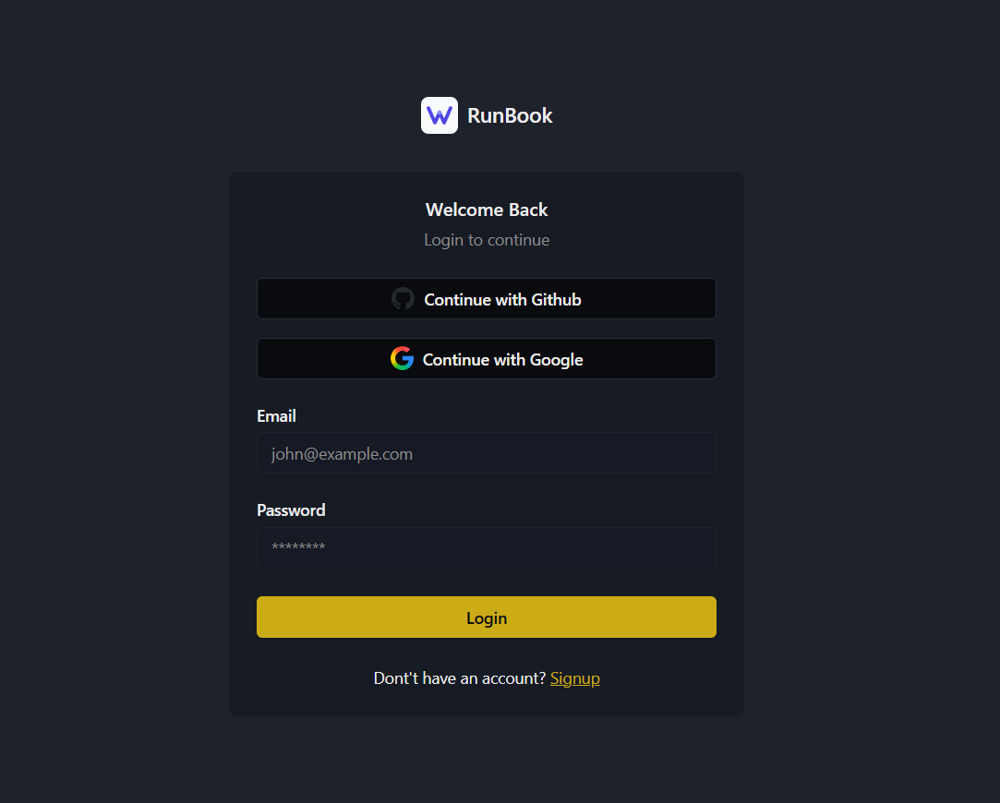

# RunBook

**A visual workflow execution engine built with Next.js 15, React Flow, Prisma, and Inngest.**

This is a full-stack application demonstrating end-to-end system design—from database schema to real-time UI updates—for webhook-triggered, AI-augmented workflow automation.

---

## Screenshots

### Login


### Workspace


### Workflow Editor


### Node Types

| HTTP Request | Stripe Trigger |
|--------------|----------------|
|  |  |

| Gemini AI | OpenAI |
|-----------|--------|
|  |  |

---

## Engineering Summary

| Dimension | Implementation |
|-----------|----------------|
| **Frontend** | Next.js 15 App Router, React 19, React Flow (node-based canvas), Jotai (state), tRPC (type-safe API) |
| **Backend** | Next.js API routes, Inngest (event-driven execution), Prisma ORM |
| **Database** | PostgreSQL with relational schema for workflows, nodes, connections |
| **Auth** | better-auth with session management |
| **AI Integration** | Vercel AI SDK with Gemini and OpenAI providers |
| **Real-time** | Inngest Realtime channels for execution status streaming |


---

## System Architecture

```
┌─────────────────────────────────────────────────────────────────────────┐
│                              CLIENT                                      │
│  ┌─────────────┐    ┌─────────────┐    ┌─────────────────────────────┐  │
│  │ React Flow  │◄──►│  Jotai      │◄──►│  tRPC React Query Client    │  │
│  │ (Canvas)    │    │  (State)    │    │  (Type-safe API calls)      │  │
│  └─────────────┘    └─────────────┘    └──────────────┬──────────────┘  │
└───────────────────────────────────────────────────────┼─────────────────┘
                                                        │
                                                        ▼
┌─────────────────────────────────────────────────────────────────────────┐
│                           NEXT.JS SERVER                                 │
│  ┌─────────────────┐    ┌─────────────────┐    ┌───────────────────┐   │
│  │ tRPC Router     │    │ Webhook Routes  │    │ Inngest Serve     │   │
│  │ (CRUD ops)      │    │ /api/webhooks/* │    │ /api/inngest      │   │
│  └────────┬────────┘    └────────┬────────┘    └─────────┬─────────┘   │
│           │                      │                       │              │
│           ▼                      ▼                       ▼              │
│  ┌─────────────────────────────────────────────────────────────────┐   │
│  │                        PRISMA CLIENT                             │   │
│  │              (Type-safe database access layer)                   │   │
│  └──────────────────────────────┬──────────────────────────────────┘   │
└─────────────────────────────────┼───────────────────────────────────────┘
                                  │
          ┌───────────────────────┼───────────────────────┐
          ▼                       ▼                       ▼
┌─────────────────┐    ┌─────────────────┐    ┌─────────────────────────┐
│   PostgreSQL    │    │    Inngest      │    │   External Services     │
│   (Persistence) │    │  (Execution)    │    │  (Gemini, OpenAI, APIs) │
└─────────────────┘    └─────────────────┘    └─────────────────────────┘
```

---

## Technical Decisions & Tradeoffs

### 1. Inngest for Workflow Execution

**Decision**: Use Inngest instead of building a custom queue/worker system.

**Why**:
- Step-level execution with automatic retries
- Built-in observability (logs, traces, replay)
- Realtime channels for status streaming
- Eliminates Redis/queue infrastructure

**Tradeoff**: Vendor dependency. Inngest is open-source and self-hostable, but the managed service is the happy path. Accepted because the alternative (Bull + Redis + custom retry logic + custom observability) would have tripled development time for the execution layer.

**Code reference**: [`src/inngest/functions.ts`](src/inngest/functions.ts)

---

### 2. Topological Sort for Execution Order

**Decision**: Compute execution order at runtime via topological sort.

**Why**:
- Workflows are DAGs (directed acyclic graphs)
- Users can connect nodes arbitrarily
- Must guarantee dependencies run before dependents

**Implementation**:
```typescript
// Edges are derived from Connection records
const edges: [string, string][] = connections.map((c) => [c.fromNodeId, c.toNodeId]);
const sortedNodeIds = toposort(edges);
```

**Edge case handled**: Nodes with no connections are included via self-edges to ensure they appear in the sorted output.

**Tradeoff**: Runtime sort on every execution. Could cache, but workflows are typically <50 nodes. O(V+E) is acceptable.

**Code reference**: [`src/inngest/utils.ts`](src/inngest/utils.ts)

---

### 3. Handlebars for Context Templating

**Decision**: Use Handlebars for injecting upstream node outputs into downstream node configurations.

**Why**:
- Users need to reference previous outputs: `{{stripe.eventType}}`
- Handlebars is well-known, safe (no arbitrary code execution), and has helpers
- Custom `json` helper for serializing objects in templates

**Example**:
```typescript
const endpoint = Handlebars.compile(data.endpoint)(context);
// "https://api.example.com/users/{{userId}}" → "https://api.example.com/users/cust_123"
```

**Tradeoff**: Limited expressiveness. No conditionals in templates. Accepted because workflow-level conditionals should be nodes, not template logic.

**Code reference**: [`src/features/executions/components/http-request/executor.ts`](src/features/executions/components/http-request/executor.ts)

---

### 4. Executor Registry Pattern

**Decision**: Node execution logic is decoupled from node types via a registry.

**Why**:
- Adding a new node type = add executor + add component
- Execution engine doesn't change
- Type safety via `NodeType` enum

**Implementation**:
```typescript
export const executorRegistry: Partial<Record<NodeType, NodeExecutor>> = {
  [NodeType.HTTP_REQUEST]: httpRequestExecutor,
  [NodeType.GEMINI]: geminiExecutor,
  [NodeType.OPENAI]: openAIExecutor,
  // ...
};

export const getExecutor = (type: NodeType): NodeExecutor => {
  const executor = executorRegistry[type];
  if (!executor) throw new Error(`No executor for: ${type}`);
  return executor;
};
```

**Tradeoff**: Partial record means runtime errors possible for unregistered types. Could use exhaustive type checking, but opted for explicit error message.

**Code reference**: [`src/features/executions/lib/executor-registry.ts`](src/features/executions/lib/executor-registry.ts)

---

### 5. Realtime Status via Inngest Channels

**Decision**: Publish execution status (loading/success/error) per node via Inngest Realtime.

**Why**:
- Users need immediate feedback during execution
- Polling is wasteful; WebSocket/SSE is better
- Inngest provides this out of the box

**Implementation**:
```typescript
await publish(
  httpRequestChannel().status({
    nodeId,
    status: "loading"
  })
);
// ... execute ...
await publish(
  httpRequestChannel().status({
    nodeId,
    status: "success"
  })
);
```

**Tradeoff**: Coupling between executor and channel definition. Each node type has its own channel. Could abstract, but explicit channels are easier to trace.

**Code reference**: [`src/inngest/channels/`](src/inngest/channels/)

---

### 6. React Flow for Visual Editor

**Decision**: Use React Flow for the node-based canvas.

**Why**:
- Mature, well-documented, performant
- Built-in support for custom nodes, edges, minimap, controls
- Large ecosystem (xyflow)

**Tradeoff**: Large dependency (~200KB). Accepted because building a custom canvas would take months and be worse.

**Code reference**: [`src/features/editor/components/editor.tsx`](src/features/editor/components/editor.tsx)

---

### 7. Prisma Schema Design

**Decision**: Separate `Node` and `Connection` tables, both referencing `Workflow`.

**Why**:
- Normalize node data (JSON column for flexible node config)
- Connections are explicit edges with `fromNodeId`, `toNodeId`, `fromOutput`, `toInput`
- Supports future multi-output nodes

**Schema**:
```prisma
model Node {
  id         String   @id @default(cuid())
  workflowId String
  workflow   Workflow @relation(...)
  type       NodeType
  position   Json
  data       Json     @default("{}")
  outputConnections Connection[] @relation("FromNode")
  inputConnections  Connection[] @relation("ToNode")
}

model Connection {
  id         String @id @default(cuid())
  workflowId String
  fromNodeId String
  toNodeId   String
  fromOutput String @default("main")
  toInput    String @default("main")
  @@unique([fromNodeId, fromOutput, toNodeId, toInput])
}
```

**Tradeoff**: `data` as JSON loses type safety at the database level. Application-level validation (Zod) compensates.

**Code reference**: [`prisma/schema.prisma`](prisma/schema.prisma)

---

## Running Locally

```bash
git clone https://github.com/yourusername/runbook.git
cd runbook

npm install

# Set environment variables
cp .env.example .env
# DATABASE_URL, INNGEST_*, GOOGLE_GENERATIVE_AI_API_KEY, OPENAI_API_KEY

# Database setup
npx prisma migrate dev

# Run dev server + Inngest
npm run dev:all
```

---

## Code Organization

```
src/
├── app/                    # Next.js App Router
│   ├── (auth)/             # Auth pages
│   ├── (dashboard)/        # Main app
│   │   ├── (editor)/       # Workflow editor
│   │   └── (rest)/         # Dashboard, lists
│   └── api/
│       ├── inngest/        # Inngest handler
│       ├── trpc/           # tRPC handler
│       └── webhooks/       # Webhook endpoints
├── features/
│   ├── auth/               # Auth utilities
│   ├── editor/             # Editor components, state
│   ├── executions/         # Node executors, components
│   ├── triggers/           # Trigger node implementations
│   └── workflows/          # Workflow CRUD, hooks
├── inngest/
│   ├── functions.ts        # Inngest function definitions
│   ├── channels/           # Realtime channels
│   └── utils.ts            # Topological sort, helpers
├── config/
│   └── node-components.ts  # Node type → component mapping
└── lib/
    └── db.ts               # Prisma client
---