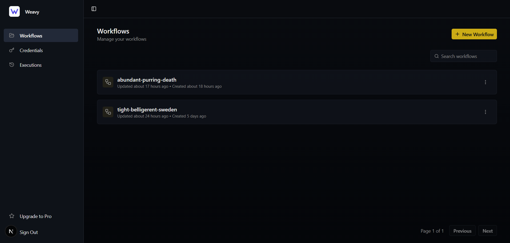
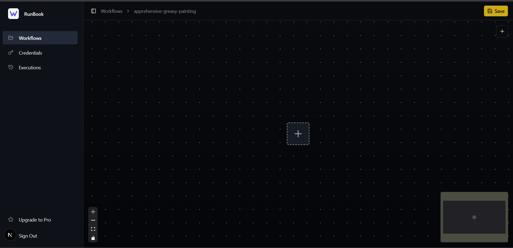
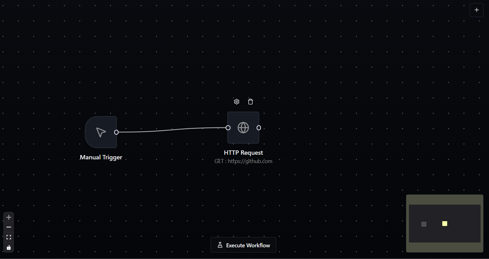
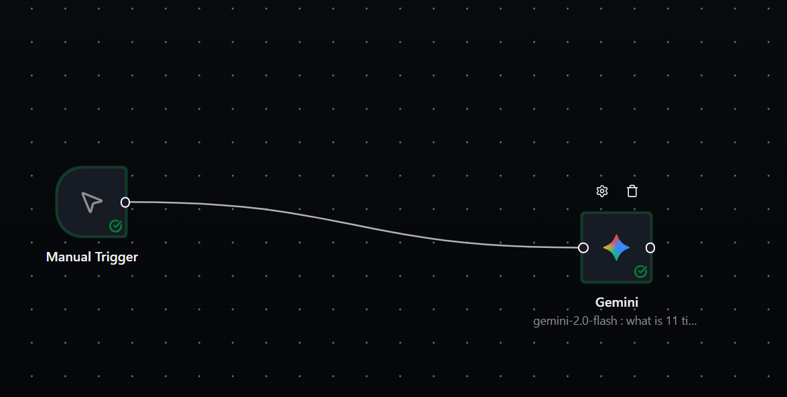
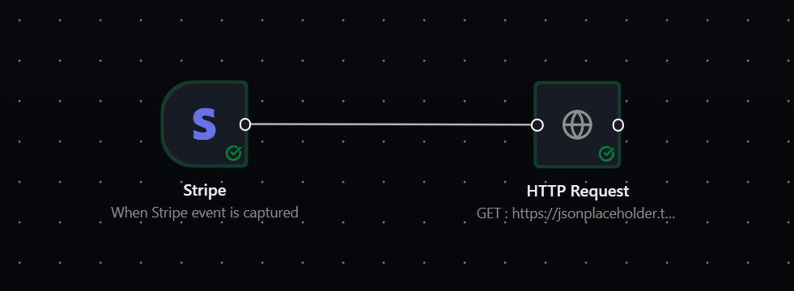
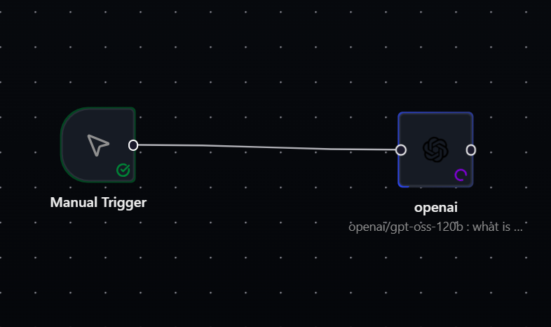
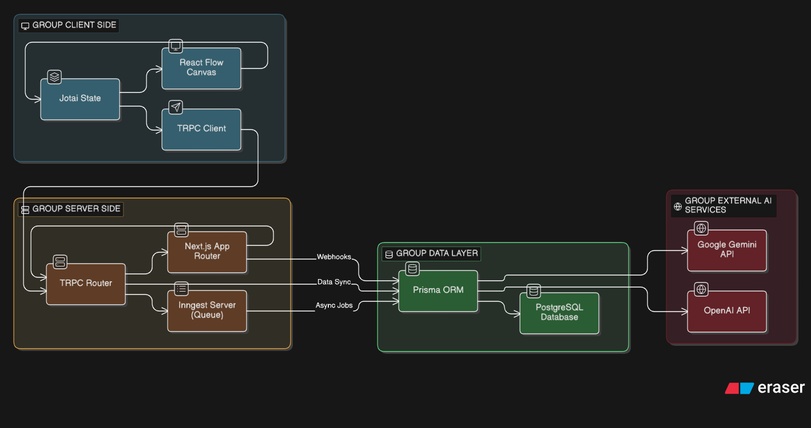

# Weavy AI

**A visual workflow execution engine built with Next.js 15, React Flow, Prisma, and Inngest.**

This application demonstrates a production-grade implementation of an event-driven, AI-augmented workflow automation platform. It features end-to-end type safety, reliable background query execution, and a high-performance node-based editor.

---

## 📸 Interface

### Core Experience
| Workspace | Workflow Editor |
|-----------|----------------|
|  |  |

### Node Types
| Integrations | AI Providers |
|--------------|--------------|
|  |  |
|  |  |

---

## 🏗 System Architecture

The system utilizes a modern, serverless-ready architecture designed for scalability and reliability.



### Data Flow
1.  **Definition**: Users construct workflows in the `React Flow` canvas. The graph state is synchronized via `tRPC` to the **PostgreSQL** database.
2.  **Trigger**: External webhooks or manual triggers hit the `/api/webhooks` endpoint.
3.  **Queue**: Events are pushed to **Inngest**, which handles durability, retries, and flow control.
4.  **Execution**: The **Workflow Engine** retrieves the DAG, performs a topological sort to determine execution order, and dispatches steps.
5.  **Feedback**: Execution status is streamed back to the frontend in real-time via persistent channels.

---

## 🛠 Technology Stack

We deliberately chose a stack that balances developer experience with production capability.

| Category | Technology | Rationale |
|----------|------------|-----------|
| **Framework** | [Next.js 15 (App Router)](https://nextjs.org/) | Leveraging React Server Components for performance and Server Actions for simplified mutations. |
| **Language** | [TypeScript](https://www.typescriptlang.org/) | Strict type safety across the entire stack, sharing types between client and server. |
| **API Layer** | [tRPC](https://trpc.io/) | End-to-end type safety without code generation or schema syncing. |
| **Database** | [Prisma](https://www.prisma.io/) + PostgreSQL | Type-safe ORM for reliable database migrations and query construction. |
| **Orchestration** | [Inngest](https://www.inngest.com/) | Durable execution engine that replaces traditional message queues (Redis/Bull) with function-level flow control. |
| **Canvas UI** | [React Flow (XYFlow)](https://xyflow.com/) | Flexible, performant library for building node-based interactable diagrams. |
| **Auth** | [Better Auth](https://better-auth.com/) | Lightweight, comprehensive authentication with built-in session management. |
| **Validation** | [Zod](https://zod.dev/) | Runtime schema validation for API inputs and environment variables. |
| **AI SDK** | [Vercel AI SDK](https://sdk.vercel.ai/docs) | Unified interface for interacting with multiple LLM providers (OpenAI, Gemini). |

---

## 🧩 Key Engineering Techniques

### 1. Reliable Workflow Orchestration (DAG execution)
Instead of a simple linear queue, the system implements a runtime topological sort to handle complex dependency graphs.
*   **Technique**: The workflow graph is treated as a Directed Acyclic Graph (DAG).
*   **Implementation**: Steps are executed only when their upstream dependencies are resolved. Inngest's `step.run` provides checkpointing, ensuring that if a long-running AI task fails, it can be retried without re-running the entire workflow.

```typescript
// Example: Dynamic dependency resolution
const sortedNodes = toposort(edges);
for (const node of sortedNodes) {
  await step.run(`execute-${node.id}`, async () => {
    // Execution logic
  });
}
```

### 2. End-to-End Type Safety
By combining **Prisma**, **tRPC**, and **Zod**, the application achieves a continuous type safety loop. A change in the database schema automatically propagates typed errors to the frontend form components.
*   **Database**: Prisma generates types from `schema.prisma`.
*   **API**: tRPC routers infer input/output types from Zod schemas and Prisma returns.
*   **Frontend**: React components use `trpc.useQuery` hooks which inherit the exact return type of the backend function.

### 3. Optimistic Updates & Real-time State
The UI feels instant thanks to a combination of optimistic UI updates and real-time streams.
*   **Optimistic**: When a user moves a node, the local state updates immediately while the DB update happens in the background.
*   **Real-time**: Workflow execution logs are streamed via **Inngest Realtime** channels, providing immediate feedback on long-running AI processes without polling.

---

## 📂 Project Structure

```text
src/
├── app/                  # Next.js App Router (Pages & Layouts)
│   ├── (dashboard)/      # Protected application routes
│   └── api/              # API Routes (tRPC, Inngest, Webhooks)
├── components/           # Shared atomic UI components (Radix primitives)
├── features/             # Domain-Driven Design (DDD) modules
│   ├── editor/           # React Flow logic, node components, toolbar
│   ├── executions/       # Logic for running workflows (Executors)
│   ├── triggers/         # Trigger node implementations
│   ├── workflows/        # Workflow CRUD operations
│   └── ...
├── inngest/              # Background functions & event definitions
├── lib/                  # Shared utilities (DB, Auth, Env)
└── trpc/                 # tRPC router and context definitions
```
*   **`src/features`**: Code is co-located by business domain rather than technical type. Each feature folder contains its own components, hooks, and server actions.
*   **`src/inngest`**: Contains the "brain" of the backend—workflow definitions and step functions.

---

## 🚀 Getting Started

1.  **Clone & Install**
    ```bash
    git clone https://github.com/your-repo/weavy-ai.git
    cd weavy-ai
    npm install
    ```

2.  **Environment Setup**
    Copy `.env.example` to `.env` and configure your keys:
    ```bash
    cp .env.example .env
    # Required: DATABASE_URL, INNGEST_SIGNING_KEY, OPENAI_API_KEY
    ```

3.  **Run Development Environment**
    We use `mprocs` to run all necessary services (Next.js, Inngest Dev Server, Prisma Studio) in a single terminal.
    ```bash
    npm run dev:all
    ```