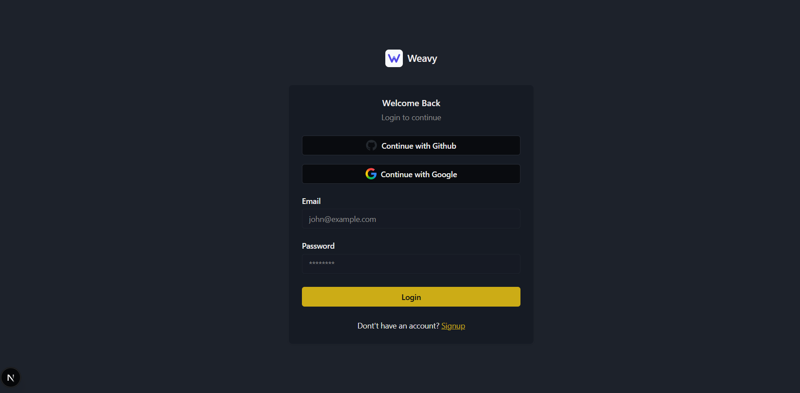
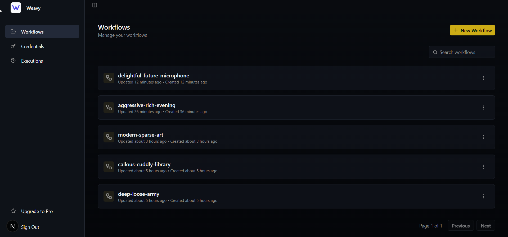
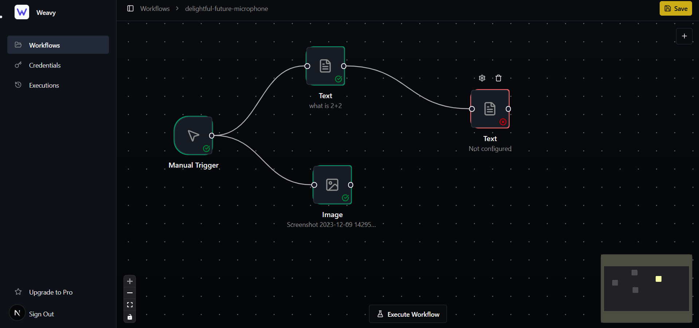
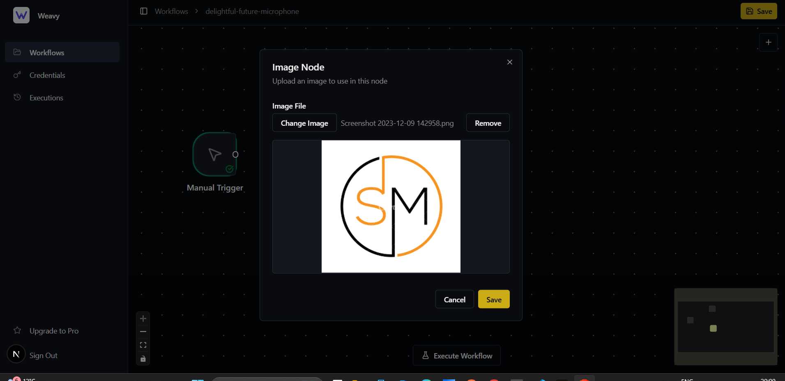
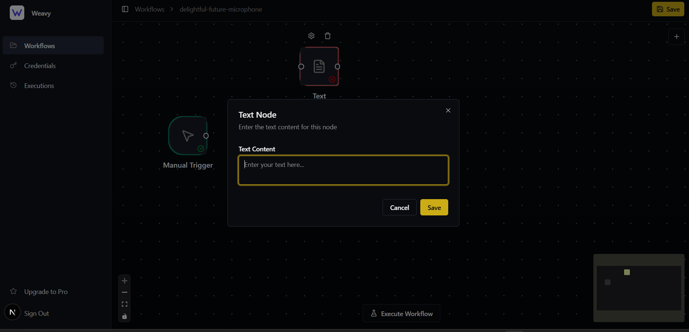

# Weavy

A modern workflow automation platform built with Next.js, featuring a visual workflow editor, authentication system, and background job processing.

## Summary of Work Done

### Authentication System
- Implemented user authentication using Better Auth
- Created login and signup pages with form validation
- Set up session management and user accounts
- Integrated OAuth providers support

### Workflow Management
- Built a comprehensive workflow CRUD system
- Created workflow listing and management pages
- Implemented workflow execution tracking
- Set up database schema for workflows, nodes, and connections using Prisma

### Visual Workflow Editor
- Developed a drag-and-drop workflow editor using React Flow (@xyflow/react)
- Implemented node-based visual editing interface
- Created custom node components for different node types:
  - Manual Trigger nodes
  - HTTP Request nodes
  - Text processing nodes
  - Image processing nodes
  - LLM nodes (prepared for AI integration)
- Added node connection system with input/output handles
- Implemented real-time workflow state management using Jotai

### Execution System
- Built executor registry pattern for extensible node execution
- Implemented workflow execution engine using Inngest for background processing
- Created topological sorting for proper node execution order
- Set up execution tracking and monitoring

### UI/UX
- Implemented comprehensive UI component library using Radix UI and shadcn/ui
- Created responsive sidebar navigation
- Built dashboard layouts with proper routing
- Added toast notifications using Sonner
- Implemented theme support with next-themes

### Backend Infrastructure
- Set up tRPC for type-safe API communication
- Configured Inngest for background job processing
- Implemented Prisma ORM with PostgreSQL database
- Created server-side data fetching and caching

## Screenshots

### Login Page

*User authentication interface with email/password and OAuth options*

### Workflow Page

*Workflow management dashboard showing all user workflows*

### Editor - Overview

*Visual workflow editor with node-based interface*

### Editor - Image Node

*Node configuration dialog for customizing node properties*

### Editor - Text Node

*Workflow execution view showing real-time execution status*

## Project Structure

```
weavy/
├── prisma/
│   ├── migrations/          # Database migrations
│   └── schema.prisma        # Database schema definition
├── public/                  # Static assets
├── src/
│   ├── app/                 # Next.js app router pages
│   │   ├── (auth)/         # Authentication routes
│   │   │   ├── login/
│   │   │   └── signup/
│   │   ├── (dashboard)/    # Protected dashboard routes
│   │   │   ├── (editor)/   # Workflow editor
│   │   │   └── (rest)/     # Other dashboard pages
│   │   └── api/            # API routes
│   │       ├── auth/       # Auth API endpoints
│   │       ├── inngest/    # Inngest webhook
│   │       └── trpc/       # tRPC API
│   ├── components/          # Reusable React components
│   │   ├── ui/             # shadcn/ui components
│   │   └── reactflow/      # React Flow custom components
│   ├── features/           # Feature-based modules
│   │   ├── auth/           # Authentication feature
│   │   ├── editor/         # Workflow editor feature
│   │   ├── executions/     # Execution system
│   │   ├── trigger/        # Trigger nodes
│   │   └── workflows/      # Workflow management
│   ├── config/             # Configuration files
│   ├── generated/          # Generated code (Prisma)
│   ├── hooks/              # Custom React hooks
│   ├── inngest/            # Inngest functions
│   ├── lib/                # Utility libraries
│   └── trpc/               # tRPC setup and routers
├── package.json
├── tsconfig.json
└── next.config.ts
```

## Key Packages and Their Purpose

### Core Framework
- **next** - React framework for production with server-side rendering and API routes
- **react** - UI library for building component-based interfaces
- **react-dom** - React rendering for web browsers
- **typescript** - Type-safe JavaScript for better developer experience

### UI Components & Styling
- **@radix-ui/react-*** - Headless, accessible UI primitives for building custom components
- **tailwindcss** - Utility-first CSS framework for rapid UI development
- **class-variance-authority** - For creating variant-based component APIs
- **clsx** - Utility for constructing className strings conditionally
- **tailwind-merge** - Merge Tailwind CSS classes without conflicts
- **lucide-react** - Icon library for consistent iconography
- **next-themes** - Theme switching support (dark/light mode)

### Workflow Editor
- **@xyflow/react** - React Flow library for building node-based visual editors
- **jotai** - Atomic state management for editor state

### Forms & Validation
- **react-hook-form** - Performant form library with easy validation
- **@hookform/resolvers** - Validation resolvers for react-hook-form
- **zod** - TypeScript-first schema validation library

### Backend & API
- **@trpc/server** - End-to-end typesafe APIs
- **@trpc/client** - tRPC client for type-safe API calls
- **@trpc/tanstack-react-query** - React Query integration for tRPC
- **@tanstack/react-query** - Powerful data synchronization for React
- **inngest** - Background job processing and workflow orchestration
- **inngest-cli** - Development tools for Inngest

### Database & ORM
- **@prisma/client** - Type-safe database client
- **prisma** - Next-generation ORM for Node.js and TypeScript

### Authentication
- **better-auth** - Modern authentication library with multiple provider support

### AI Integration
- **@ai-sdk/google** - Google AI SDK for Gemini integration
- **ai** - Vercel AI SDK for building AI-powered applications

### Utilities
- **@paralleldrive/cuid2** - Collision-resistant unique identifiers
- **date-fns** - Modern JavaScript date utility library
- **superjson** - Serialize complex JavaScript objects for tRPC
- **toposort** - Topological sorting for dependency resolution
- **nuqs** - Type-safe URL search params for Next.js
- **cmdk** - Command menu component (command palette)
- **sonner** - Toast notification library
- **recharts** - Composable charting library
- **react-resizable-panels** - Resizable panel layouts
- **embla-carousel-react** - Carousel component library
- **vaul** - Drawer component library
- **input-otp** - OTP input component
- **react-day-picker** - Date picker component
- **react-error-boundary** - Error boundary component
- **client-only** - Mark components as client-only
- **server-only** - Mark modules as server-only

### Development Tools
- **eslint** - Code linting
- **eslint-config-next** - ESLint config for Next.js
- **@types/node** - TypeScript types for Node.js
- **@types/react** - TypeScript types for React
- **@types/react-dom** - TypeScript types for React DOM
- **@types/toposort** - TypeScript types for toposort
- **tsx** - TypeScript execution engine
- **tw-animate-css** - Tailwind CSS animations

## Getting Started

### Prerequisites
- Node.js 18+ or Bun
- PostgreSQL database
- Inngest account (for background jobs)

### Installation

1. Clone the repository
2. Install dependencies:
   ```bash
   npm install
   # or
   bun install
   ```

3. Set up environment variables:
   ```env
   DATABASE_URL="postgresql://..."
   BETTER_AUTH_SECRET="..."
   BETTER_AUTH_URL="http://localhost:3000"
   INNGEST_EVENT_KEY="..."
   INNGEST_SIGNING_KEY="..."
   ```

4. Run database migrations:
   ```bash
   npx prisma migrate dev
   ```

5. Start the development server:
   ```bash
   npm run dev
   # or
   bun dev
   ```

6. Start Inngest dev server (in another terminal):
   ```bash
   npm run inngest:dev
   ```

## Development Scripts

- `npm run dev` - Start Next.js development server
- `npm run build` - Build for production
- `npm run start` - Start production server
- `npm run lint` - Run ESLint
- `npm run inngest:dev` - Start Inngest dev server
- `npm run dev:all` - Start all services (Next.js + Inngest) using mprocs

## Tech Stack Summary

- **Frontend**: Next.js, React 19, TypeScript
- **UI**: Radix UI, Tailwind CSS, shadcn/ui
- **State Management**: Jotai, React Query
- **Forms**: React Hook Form, Zod
- **Backend**: Next.js API Routes, tRPC
- **Database**: PostgreSQL, Prisma ORM
- **Authentication**: Better Auth
- **Background Jobs**: Inngest
- **Workflow Editor**: React Flow
- **AI**: Vercel AI SDK, Google Gemini

## License

Private project
